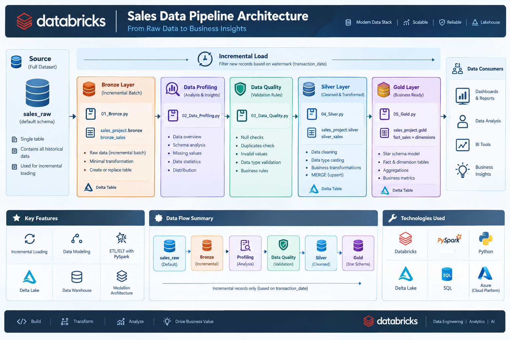

# Databricks Sales Data Pipeline

An end-to-end sales data pipeline built with **Databricks, PySpark, Spark SQL, and Delta Lake**.

The project demonstrates how raw sales data can be ingested, profiled, validated, cleaned, transformed, modeled into analytical tables, and validated across pipeline layers.

## Architecture



### Pipeline Flow

```text
CSV Source
    ↓
Bronze
    ↓
Profiling / Data Quality
    ↓
Silver
    ↓
Gold


## Technologies

- Databricks
- PySpark
- Spark SQL
- Delta Lake
- SQL
- Python
- Medallion Architecture
- Incremental Data Loading
- Data Quality Checks
- Data Modeling

## Project Structure

```text
databricks-sales-data-pipeline/
│
├── notebooks/
│   ├── 01_Bronze.py
│   ├── 02_Data_Profiling.py
│   ├── 03_Data_Quality.py
│   ├── 04_Silver.py
│   └── 05_Gold.py
│
├── data/
│   └── README.md
│
├── docs/
│   └── architecture.png
│
├── .gitignore
└── README.md
```

## Bronze Layer

The Bronze layer reads the source sales table and applies a date-based incremental extraction strategy.

The pipeline uses the maximum transaction date already present in Bronze as a watermark. A one-day overlap is used when calculating the next extraction window to reduce the risk of missing records around the watermark boundary.

## Data Profiling

The profiling notebook checks characteristics of the Bronze data, including:

- Null values
- Duplicate rows
- Transaction ID uniqueness
- Date range
- Category distribution
- Payment method distribution
- Discount distribution
- Invalid-value checks

## Data Quality

The Data Quality notebook contains explicit rules for:

- `transaction_id` not null
- `customer_id` not null
- `transaction_id` uniqueness
- `total_spent = price_per_unit × quantity`

The notebook produces PASS/FAIL-style results and an overall quality summary.

> Note: Data Quality is currently implemented as a validation notebook and is not configured as a blocking task in the Databricks workflow.

## Silver Layer

The Silver layer applies data cleaning and transformation, including:

- Data type casting
- Null handling
- Removing records with missing critical numeric fields
- Replacing missing item values with `Unknown`
- MERGE-based upsert using `transaction_id`

The resulting table is:

```text
sales_project.silver.silver_sales
```

## Gold Layer

The Gold layer creates analytical tables from the Silver data.

Current tables include:

```text
sales_project.gold.dim_customer
sales_project.gold.dim_item
sales_project.gold.dim_location
sales_project.gold.dim_payment
sales_project.gold.dim_discount
sales_project.gold.dim_sales
sales_project.gold.fact_sales
```

The model uses dimension tables and a fact table to support analytical queries.

## Incremental Loading

The intended incremental strategy is based on `transaction_date`:

1. Read the current maximum transaction date from Bronze.
2. Subtract one day to create an overlap window.
3. Read source records from that date onward.
4. Process the incoming records through Silver.
5. Use `MERGE` in Silver based on `transaction_id`.

This approach demonstrates an incremental ETL pattern rather than reprocessing the entire source on every run.

## Databricks Workflow

The production-style workflow should run the transformation notebooks in dependency order:

```text
01_Bronze
    ↓
04_Silver
    ↓
05_Gold


Profiling and Data Quality can remain available as supporting validation notebooks. If Data Quality is later configured as a blocking gate, the workflow can be changed so that a failed quality check stops downstream tasks.


## Future Improvements

- Add a blocking Data Quality Gate to the Databricks workflow.
- Use stable surrogate-key management for Gold dimensions.
- Add automated tests for schema and business rules.
- Add cloud storage as an external source.
- Add orchestration and monitoring improvements.
